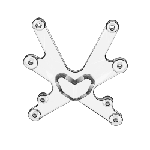
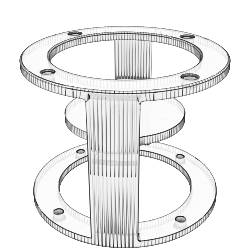
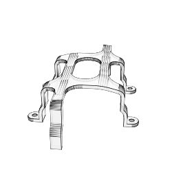
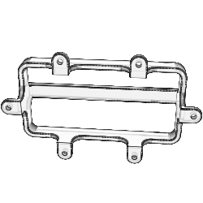
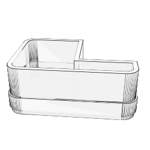

# Pipe Buoy: 3D Parts

This repository contains all the 3D parts for the Pipe Buoy project.  
Always make sure to pull the latest before starting a new build.  

## Generic Module

This part is the most generic part of the project. It is used to connect the different modules together. Its platform runs perpendicular to the pipes endcaps. In the hackaday project, this part is used to hold both the batteries. Another instance of the part is used to hold the Raspberry Pi, SSD, and USB Cell Modem. **Filename:** [<a href="./parts/GenericModule.stl">GenericModule.stl</a>] **Drawn By:** Brett Smith

     
## Raspberry Pi Mounting Adapter

Because the Raspberry Pi's mounting holes are not in the same place as the generic module, we use this part to mount the Raspberry Pi to the generic bolt pattern found on the module. **Filename:** [<a href="./parts/RaspberryPiMountingAdapter.stl">RaspberryPiMountingAdapter.stl</a>] **Drawn By:** Brett Smith

     
## Cell Antenna Module

This module is used to hold the cell antenna. Its platform runs parallel to the pipes endcaps. **Filename:** [<a href="./parts/CellAntennaModule.stl">CellAntennaModule.stl</a>] **Drawn By:** Brett Smith

     
## SSD And Modem Strap

This part is used to hold the SSD and USB Cell Modem to the generic module. **Filename:** [<a href="./parts/SSDAndModemStrap.stl">SSDAndModemStrap.stl</a>] **Drawn By:** Brett Smith

     
## Shorty Strap

This part is used to hold 2S 'shorty' batteries to the generic module. **Filename:** [<a href="./parts/ShortyStrap.stl">ShortyStrap.stl</a>] **Drawn By:** Brett Smith

     
## Reef Camera Internal Mount

Not used for the internals of the pipe buoy, but rather for the reef camera. This part is used to correctly orient the USB Camera inside of the GoPro housing. **Filename:** [<a href="./parts/ReefCameraInternalMount.stl">ReefCameraInternalMount.stl</a>] **Drawn By:** Brett Smith

     
